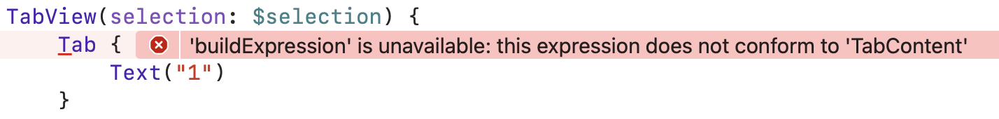

# Bad Compiler Error with `TabView` missing `value`

### FB16427059

This demo shows how bad the compiler (does not) informs a developer that 
it's missing the `value` parameter in a `Tab` when a `selection` is given.

Instead, it spits `'buildExpression' is unavailable: this expression does not conform to 'TabContent'` which is really not understandable

